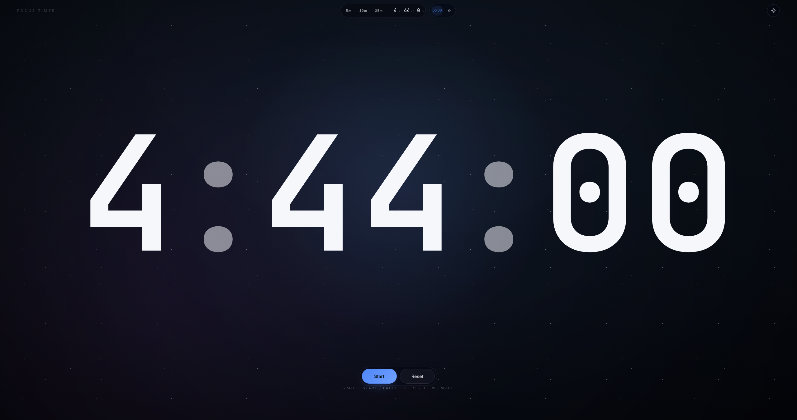

# react-timer

A simple, modern timer app built with **React** and **Vite**. Designed for focus and clarity.


*A glimpse of the timer, captured with a screenshot.*

*🌐 [Visit the live site](https://mcckyle.github.io/react-timer/)*

---

## Features

- ⚡ Instant load with [Vite](https://vitejs.dev/)
- 💡 Dynamic ambient background design combined with a dark-themed interface
- 📱 Responsive layout for desktop and mobile
- 🧠 Built with composability and future enhancements in mind!

---

## 🚀 Getting Started

Clone the repository and install dependencies:

```bash
git clone https://github.com/mcckyle/react-timer.git
cd react-timer
npm install
```

Start the development server:

```bash
npm run dev
```

Build for production:

```bash
npm run build
```

---

## 🛠️ Tech Stack

- [React](https://reactjs.org/)
- [Vite](https://vitejs.dev/)
- [Motion](https://motion.dev/)

---

## 📁 Project Structure

```
react-timer/
├── .github/              # GitHub workflows (CI/CD).
├── public/               # Static assets (served as-is).
├── src/                  # Application Source code.
│   ├── components/       # Reusable React components.
│   │   ├── Timer/
│   │   │   ├── Timer.jsx
│   │   │   └── Timer.css
│   │   │
│   │   ├── TimerHeader/
│   │   │   ├── TimerHeader.jsx
│   │   │   └── TimerHeader.css
│   │   │
│   │   ├── AmbientBackground/
│   │   │   ├── AmbientBackground.jsx
│   │   │   └── AmbientBackground.css
│   │   │
│   │   ├── AnimatedDigit/
│   │   │   ├── AnimatedDigit.jsx
│   │   │   └── AnimatedDigit.css
│   │   │
│   │   ├── TimerDisplay/
│   │   │   ├── TimerDisplay.jsx
│   │   │   └── TimerDisplay.css
│   │   │
│   │   ├── VisualTimer/
│   │   │   ├── VisualTimer.jsx
│   │   │   └── VisualTimer.css
│   │   │
│   │   ├── TimeField/
│   │   │   ├── TimeField.jsx
│   │   │   └── TimeField.css
│   │   │
│   │   ├── TimerControls/
│   │   │   ├── TimerControls.jsx
│   │   │   └── TimerControls.css
│   │   │
│   │   ├── PastTimers/
│   │   │   ├── PastTimers.jsx
│   │   │   └── PastTimers.css
│   │   │
│   │   ├──DurationPicker/
│   │   │   ├── DurationPicker.jsx
│   │   │   └── DurationPicker.css
│   │   │
│   │   ├── ThemeWrapper.jsx
│   │   └── theme.css
│   │
│   ├── utils/
│   │   ├── formatTime.jsx
│   │   ├── formatDuration.jsx
│   │   └── splitDuration.jsx
│   │
│   ├── context/
│   │   └── ThemeContext.jsx
│   │
│   ├── __tests__/
│   │   ├── useTimer.test.jsx
│   │   └── AnimatedDigit.test.jsx
│   │
│   ├── hooks/            # Custom React hooks.
│   │   ├── useTimer.js
│   │   ├── useKeyboardShortcuts.js
│   │   ├── useAmbientEngine.js
│   │   └── useCompletionSound.js
│   │
│   ├── App.jsx           # Main React application component.
│   ├── main.jsx          # React DOM entry point.
│   ├── App.css           # Styles specific to App.jsx.
│   └── index.css         # Global styles.
│
├── .gitignore            # Specifies intentionally untracked files and folders to ignore.
├── LICENSE               # Open source license for the project.
├── README.md             # Project overview, instructions, and documentation.
├── eslint.config.js      # ESLint configuration.
├── index.html            # HTML entry point.
├── vite.config.js        # Vite config for build and development.
├── vitest.setup.js       # Vitest config for unit testing purposes.
├── package.json          # Project metadata, dependencies, and scripts.
└── package-lock.json     # Exact versions of installed dependencies.
```

---

## 🎯 Roadmap

Phase 1: Core Timer Mechanics & State.
- [x] Keyboard shortcuts for core controls.
- [x] Add light/dark mode toggle with animation.
- [ ] Integrate web workers to prevent the browser from throttling timer accuracy when backgrounded.
- [ ] Add tab title updates to show remaining time and a play/pause icon.

Phase 2: Ambient Background System
- [ ] Build an audio mixer dashboard to layer sounds (e.g., rain, white noise, cafe chatter).
- [ ] Design CSS canvas/WebGL particle effects that react to the audio frequence or timer countdown speed.
- [ ] Add a smooth audio fade-out when the timer hits zero to prevent abrupt sound cutting.
- [ ] Implement a fullscreen presentation mode that hides all UI elements except the timer and ambient background.

Phase 3: System Integration & Polish
- [ ] Integrate the Web Notification API to alert users when a session ends if they are in another tab.
- [ ] Add a Screen Wake Lock API toggle to keep the display from turning off during a focus session.
- [ ] Support picture-in-picture mode for the timer text using the Document Picture-in-Picture API.

Phase 4: Optimization & Testing
- [ ] Component test the audio controls using React Testing Library.
- [ ] Profile performance to ensure the ambient animations do not spike CPU/GPU usage.

---

## 📄 License

This project is licensed under the [MIT License](./LICENSE).
Feel free to extend it for your own projects, or contribute improvements back to the community.

---

## 🙌 Acknowledgments

This project was made possible thanks to the open-source community and the following technologies:

- [React](https://react.dev) - A modern library designed specifically for building fast, interactive UIs.
- [Vite](https://vitejs.dev/) - Next-generation frontend tooling with lightning-fast dev server and build optimizations.
- [Motion](https://motion.dev/) - A production-grade animation library for the web.
- [FreeSound](https://freesound.org/) - Thanks to user @juskiddink for the bell audio.

bell3.wav by juskiddink -- https://freesound.org/s/59536/ -- License: Attribution 4.0 -- https://creativecommons.org/licenses/by/4.0/

Only changed the filename on download: bell3.wav -> bell.mp3

Special thanks to the broader open-source ecosystem for the tools that empower developers to create and share freely.
